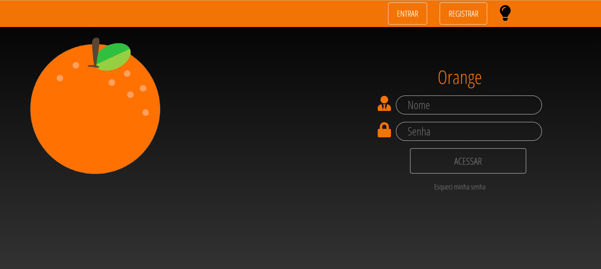
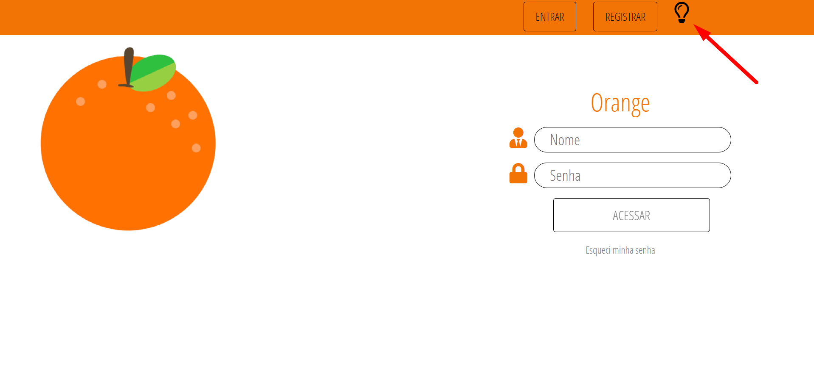
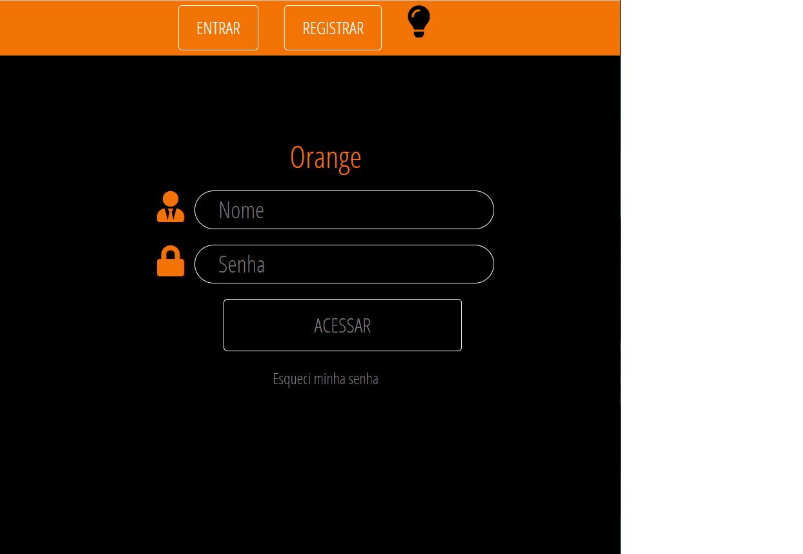
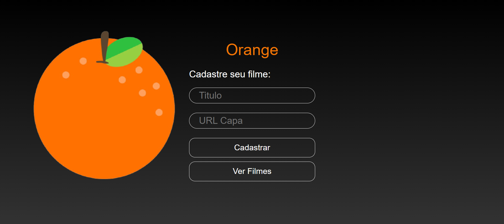
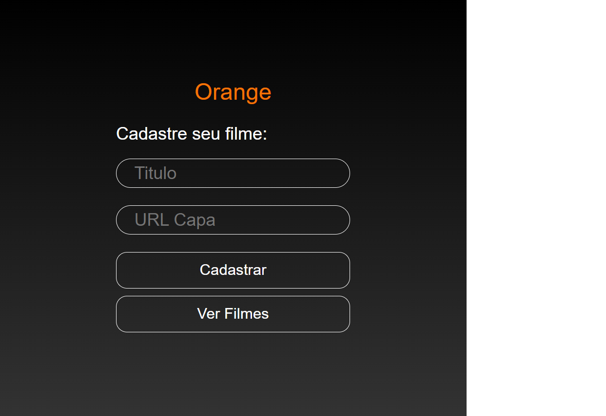
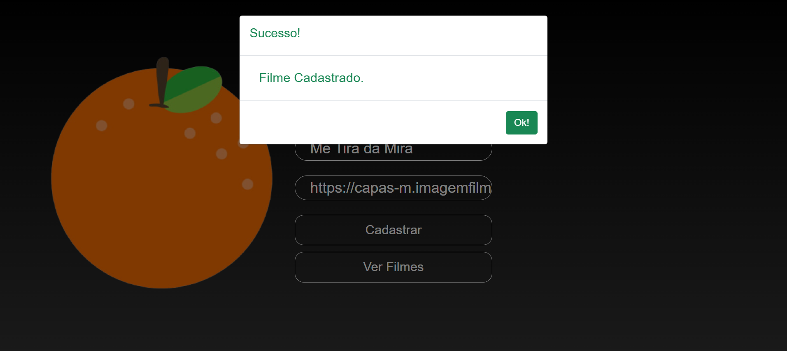
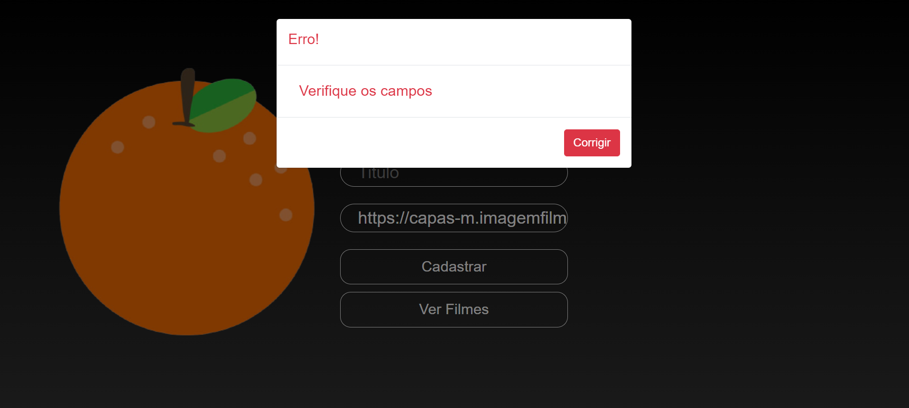
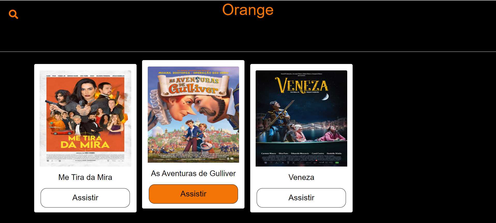

<h1>Orange🍊</h1>

<h2>Sobre:</h2>

Nesse projeto meu objetivo era ter uma telinha que solicita-se algumas informações para que fossem registradas no LocalStorage e depois recuparedas em outra tela. Então desenvolvi esse projeto simples, onde solicita um titulo e a capa do filme. 📽️

<h2>Fonte</h2>

Site que usei para copiar as capas com uma boa qualidade: https://imagemfilmes.com.br/filmes 

<h2>Imagens</h2>
<h3>Login 🏠</h3>

Tema Escuro

<h3>Login</h3>

Tema Claro

<h3>Login</h3>

Tela ≥576px

<h3>Cadastrar Filme ➕</h3>

<h3>Cadastrar Filme ➕</h3>

Tela ≥576px

<h3>Cadastro feito com sucesso ✔️</h3>

<h3>Cadastro não feito com sucesso ❌</h3>

<h3>Filmes Cadastrados 🎞️</h3>

